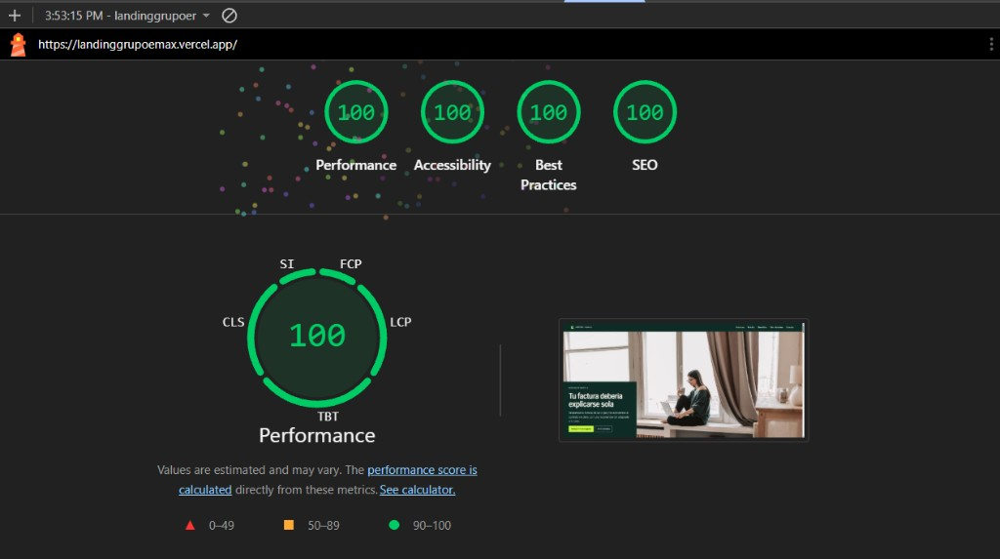
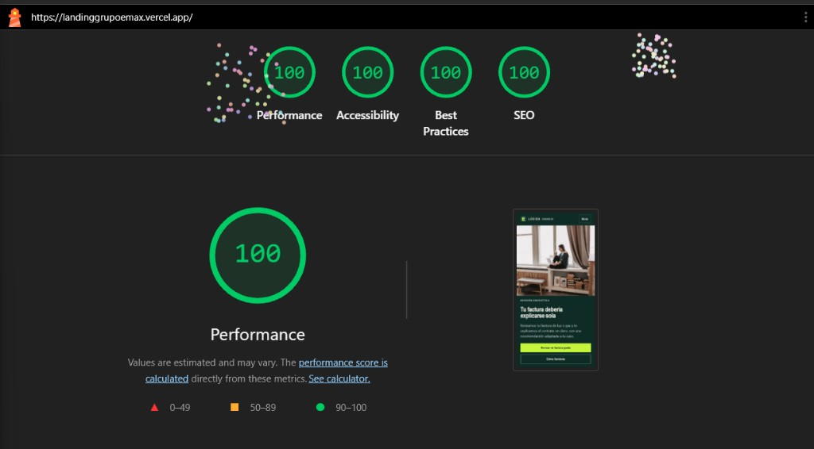

# LÚCIDA — Asesoría energética

Landing page desarrollada para la prueba técnica de Grupo EMAX. Presenta un servicio conceptual de revisión energética para hogares, autónomos y pymes del mercado español.

## Demo

[Ver landing publicada](https://landinggrupoemax.vercel.app)

## Objetivo

Convertir una factura difícil de interpretar en una experiencia clara y orientada a solicitar una revisión gratuita, sin inventar clientes, testimonios ni porcentajes de ahorro.

## Tecnología

- [Astro 7](https://astro.build/) para generar una página estática rápida.
- TypeScript estricto para la lógica del formulario y las animaciones.
- CSS nativo con variables de diseño y estilos encapsulados por componente.
- GSAP y ScrollTrigger para movimiento progresivo sin alterar el scroll nativo.
- Lucide para iconografía ligera y consistente.

## Ejecución local

Requiere Node.js 22.12 o superior.

```bash
npm install
npm run dev
```

La aplicación estará disponible normalmente en `http://localhost:4321`.

Comprobación de tipos y build de producción:

```bash
npm run build
npm run preview
```

## Organización

```text
src/
├── components/
│   ├── brand/       # Isologo reutilizable
│   ├── layout/      # Header y footer
│   └── sections/    # Capítulos independientes de la landing
├── layouts/         # Metadatos y estructura base
├── pages/           # Composición de la página
├── scripts/         # Movimiento progresivo con GSAP
├── services/        # Puerto y adaptador simulado para solicitudes
└── styles/          # Tokens y estilos globales
```

Cada sección conserva una única responsabilidad. La página principal solo ordena los capítulos; la recepción de solicitudes está abstraída mediante `LeadService`, por lo que puede sustituirse el adaptador de demostración sin reescribir el formulario.

## Decisiones de diseño

- **Concepto:** “La factura se vuelve transparente”.
- **Dirección visual:** composición editorial, verde petróleo, blanco mineral y un único acento verde eléctrico.
- **Narrativa:** alternancia entre escenas fotográficas, explicación y una factura visual reconocible.
- **Movimiento:** transiciones ligadas al significado y fondo cinematográfico `sticky`, sin scroll-jacking.
- **Conversión:** una acción principal consistente: solicitar una revisión gratuita.
- **Responsive:** composición específica para móvil, tablet y escritorio; el contenido fijado se transforma en flujo vertical en pantallas pequeñas.
- **Accesibilidad:** HTML semántico, navegación por teclado, foco visible, mensajes de error asociados y soporte para `prefers-reduced-motion`.

Las decisiones detalladas están documentadas en [`DESIGN.md`](./DESIGN.md) y el alcance de producto en [`PRODUCT.md`](./PRODUCT.md).

## Formulario

El formulario valida nombre, teléfono, email, tipo de cliente y mensaje. Para esta prueba utiliza un adaptador local que simula una recepción exitosa y no persiste información. En producción debe sustituirse por un endpoint seguro con validación de servidor, protección antiabuso y una política de privacidad real.

## Uso de IA y proceso de diseño

La IA se utilizó como apoyo para:

- analizar el brief y estructurar el contenido;
- explorar la dirección visual y el sistema de diseño;
- revisar responsive, accesibilidad y consistencia;
- detectar errores y asistir en la implementación.

El resultado fue adaptado, corregido y validado manualmente. El diseño se desarrolló directamente en código mediante iteraciones visuales; no se incluye un archivo de Figma como si hubiera formado parte del proceso.

## Estado de QA

- `astro check`: sin errores ni advertencias.
- Build estático de producción: correcto.
- Responsive validado en 390 × 844, 768 × 1024 y 1440 × 900 px.
- Flujo completo del formulario verificado.
- Lighthouse: Performance 100, Accessibility 100, Best Practices 100 y SEO 100.

Los resultados y observaciones están documentados en [`QA_REPORT.md`](./QA_REPORT.md).

### Evidencia Lighthouse

Las auditorías deben ejecutarse en una ventana de incógnito o con todas las extensiones deshabilitadas. Extensiones como analizadores tecnológicos, traductores o herramientas de desarrollo inyectan scripts en la página y alteran métricas como Total Blocking Time, JavaScript no utilizado y trabajo del hilo principal.

#### Desktop — 100/100/100/100



#### Mobile — 100/100/100/100



## Alcance conceptual

LÚCIDA es una identidad creada para esta prueba. Los datos de la factura son sintéticos y los textos legales son demostrativos. La página no representa una empresa ni un servicio energético en operación.
